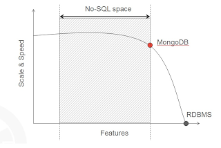

# MongoDB

Primeiramente vamos entender o são banco de dados não relacionais (famosos NoSql). Basicamente surgiram com o intuito de resolver problemas específicos que os bancos relacionais não conseguem resolver eficientemente devido a estratégia de orquestração dos dados.

Os bancos de dados não relacionais tem por objetivo:

- Escalabilidade;
- Adaptabilidade dos dados;
- Facilidade de operação;

Existem diversos tipos de bancos de dados não relacionais e dentre eles temos:

- Chave/Valor;
- Documento;
- Grafo;
- Coluna;
- Híbridos;

MongoDB é um banco de dados orientado a arquivos projetado para facilitar o desenvolvimento e escalar com eficiência. Basicamente ele concilia a distribuição entre funcionalidades e escalabilidade para maximizar o desempenho e fornecer uma interface de operação fácil e intuitiva.

A ilustração abaixo mostra a distribuição do mongo dentre os demais banco de dados.

